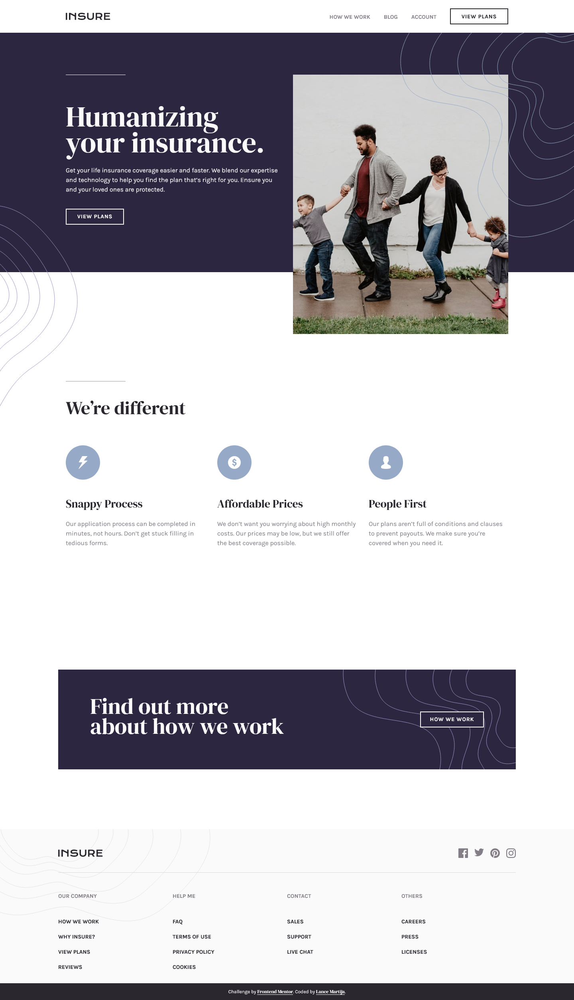
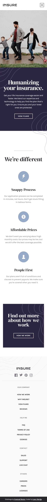
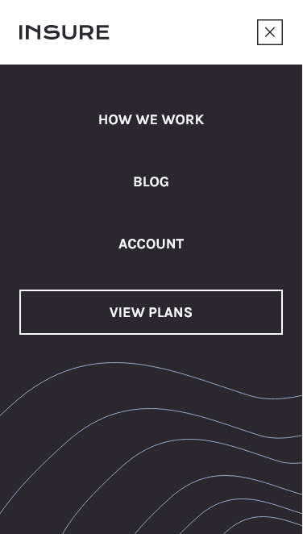

# Frontend Mentor - Insure landing page solution

This is a solution to the [Insure landing page challenge on Frontend Mentor](https://www.frontendmentor.io/challenges/insure-landing-page-uTU68JV8). Frontend Mentor challenges help you improve your coding skills by building realistic projects. 

## Table of contents

- [Overview](#overview)
  - [The challenge](#the-challenge)
  - [Screenshot](#screenshot)
  - [Links](#links)
- [My process](#my-process)
  - [Built with](#built-with)
- [Author](#author)

## Overview

### The challenge

Users should be able to:

- View the optimal layout for the site depending on their device's screen size
- See hover states for all interactive elements on the page

### Screenshot

### Links

- Solution URL: [Insure Landing Page Solution](https://your-solution-url.com)
- Live Site URL: [Insure Landing Page](https://lancemartija.github.io/Insure-Landing-Page/)

## My process

### Built with

- Semantic HTML5 markup
- CSS custom properties
- Flexbox
- CSS Grid
- Sass Framework

## Author

- Website - [Lance Martija](https://github.com/lancemartija)
- Frontend Mentor - [@lancemartija](https://www.frontendmentor.io/profile/lancemartija)
- Twitter - [@lancemartija](https://www.twitter.com/lancemartija)